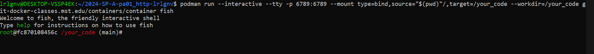
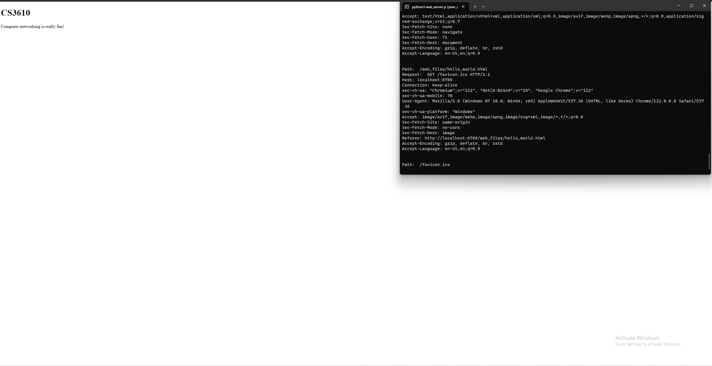
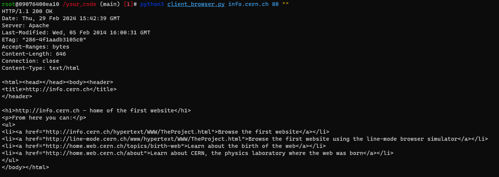
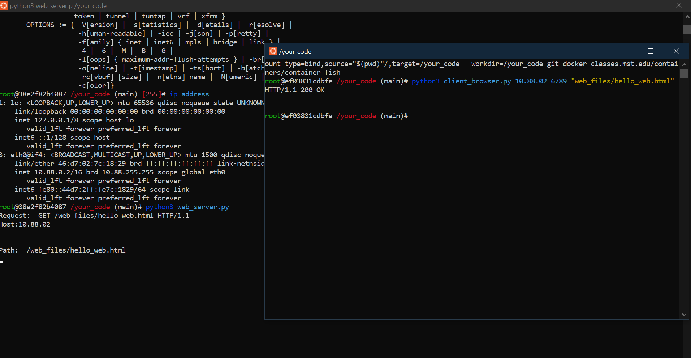

The first part of the assignment of running a docker file simply consisted of downloading docker and running the command podman run --interactive --tty -p 6789:6789 --mount type=bind,source="$(pwd)"/,target=/your_code --workdir=/your_code git-docker-classes.mst.edu/containers/container fish. This created the docker for the fish shell with port 6789 exposed.

The next step was to create the web server. This step involved receving data with python socket, decoding it, splitting it into the parts required, then sending back an ok header if ok, or a 404 not found header if the request is not valid. The server listens and accepts through port 6789, then has threading for efficieny. It returns the correct html page for the request, and should look like:

After that the client browser requeires editing to properly break down the system arguments into usable parts. THe client attempts to connect to the host and port provided by the user, and sents a GET request following HTTP standards. It then receives and decode the data.

Last is to test communication between the two containers. I was unable to complete this 
