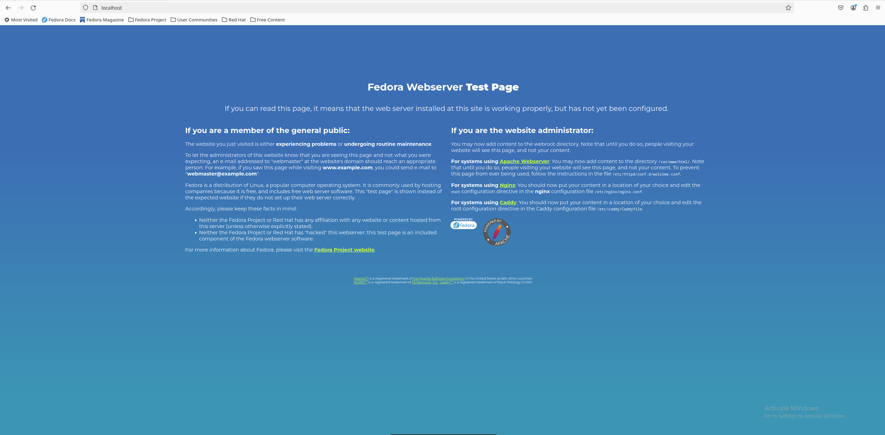
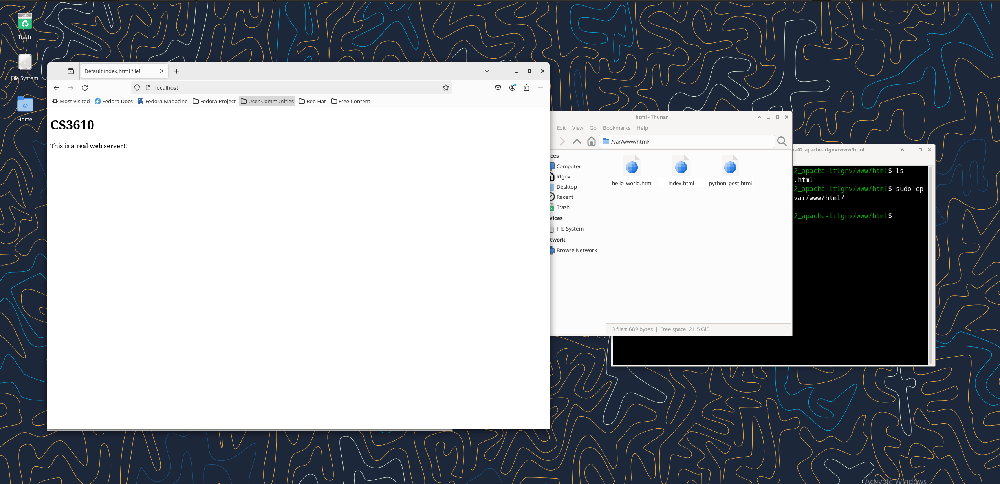

For this project I used a fedora virtual machine setup through virtualbox. The setup of apache was extremely extremely easy to setup. After downloading httpd, running systemctl start httpd.service. Visiting localhost provides this:

Wiresharking this shows unencrypted tcp data. Following this data gives GET request. This request is:

GET / HTTP/1.1
Host: localhost
User-Agent: Mozilla/5.0 (X11; Linux x86_64; rv:122.0) Gecko/20100101 Firefox/122.0
Accept: text/html,application/xhtml+xml,application/xml;q=0.9,image/avif,image/webp,*/*;q=0.8
Accept-Language: en-US,en;q=0.5
Accept-Encoding: gzip, deflate, br
Connection: keep-alive
Upgrade-Insecure-Requests: 1
Sec-Fetch-Dest: document
Sec-Fetch-Mode: navigate
Sec-Fetch-Site: none
Sec-Fetch-User: ?1
If-Modified-Since: Wed, 20 Mar 2024 00:51:43 GMT
If-None-Match: "ae-6140cfe95af71"

HTTP/1.1 304 Not Modified
Date: Wed, 20 Mar 2024 01:04:25 GMT
Server: Apache/2.4.58 (Fedora Linux)
Last-Modified: Wed, 20 Mar 2024 00:51:43 GMT
ETag: "ae-6140cfe95af71"
Accept-Ranges: bytes
Keep-Alive: timeout=5, max=100
Connection: Keep-Alive

GET / HTTP/1.1
Host: localhost
User-Agent: Mozilla/5.0 (X11; Linux x86_64; rv:122.0) Gecko/20100101 Firefox/122.0
Accept: text/html,application/xhtml+xml,application/xml;q=0.9,image/avif,image/webp,*/*;q=0.8
Accept-Language: en-US,en;q=0.5
Accept-Encoding: gzip, deflate, br
Connection: keep-alive
Upgrade-Insecure-Requests: 1
Sec-Fetch-Dest: document
Sec-Fetch-Mode: navigate
Sec-Fetch-Site: none
Sec-Fetch-User: ?1
If-Modified-Since: Wed, 20 Mar 2024 00:51:43 GMT
If-None-Match: "ae-6140cfe95af71"

HTTP/1.1 304 Not Modified
Date: Wed, 20 Mar 2024 01:04:29 GMT
Server: Apache/2.4.58 (Fedora Linux)
Last-Modified: Wed, 20 Mar 2024 00:51:43 GMT
ETag: "ae-6140cfe95af71"
Accept-Ranges: bytes
Keep-Alive: timeout=5, max=99
Connection: Keep-Alive

After providing an html page to the file directory given by this page, the webserver is already running.
Communcation with this page is easily wiresharked, as it is unencrypted tcp.

Providing permissions consisted of chmod followed by the specified permissions, with --recursive to target each file in the directory. After this the assignment is done, and the page can be used for python scripts.