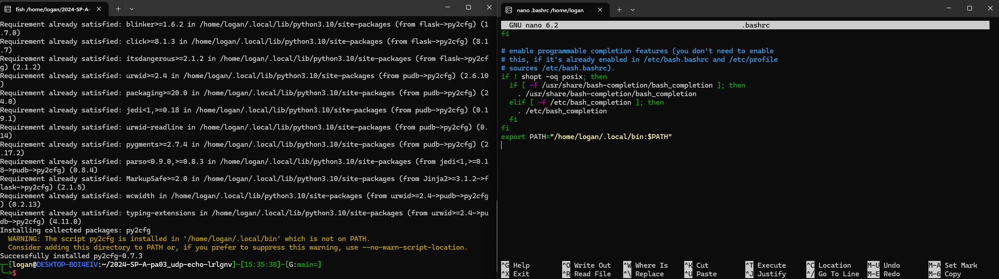
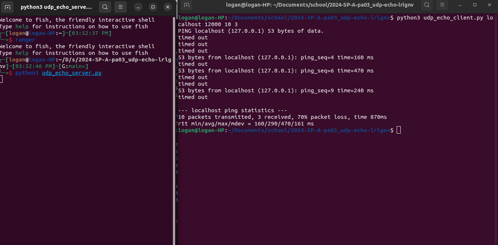

The first part of this project was to ping servers using socket.

This is the format to copy. It was easy to create this using socket. All it takes is creating the message, sending using socket.sendto and receiving using socket.receive. To do the calculations, time.time() was used to measure how long this took.

This is my program pinging localhost.

To turn this into a scapy program, most of the code remained the same. The only thing changed was instead of socket.sendto and socket.receive, sr1(IP(dst=SERVER_HOSTNAME) / UDP(sport=12001, dport={SERVER_PORT}) / message, verbose=0) was used. The sr1 sends and receives a packet, UDP is the protocol with specified ports, message was the thing send, and verbosity 0 prevents scapy from printing its messages.